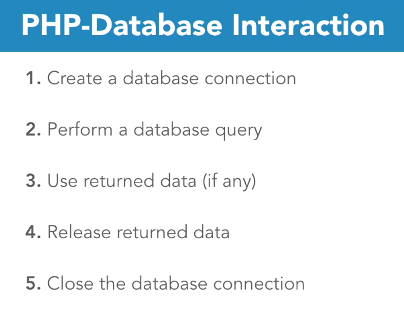
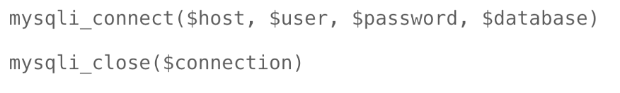
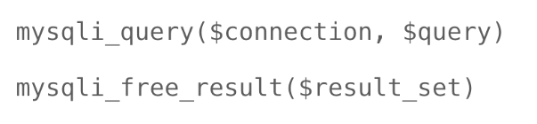
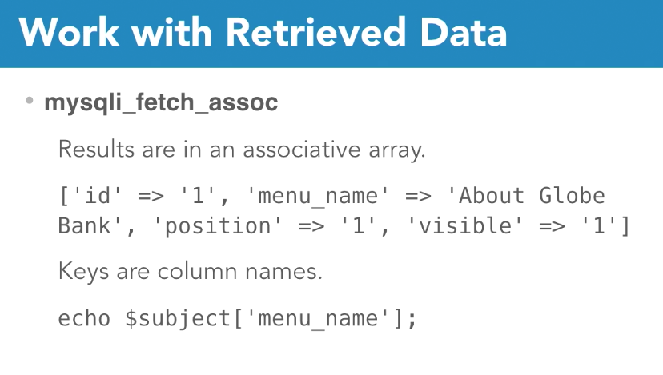

# PHP & MySQL Notes

## 5 steps to working with MySQL and PHP

### Step 1 - Create a database connection

	
		mysqli_connect($host, $user, $pw, $db)

* set your connection string to a $var

### Step 2 - Query the database

	mysqli_query($connection, $query)
		
### Step 3 -  Work with retrived Data

### Step 4 - Release data drom memory

		mysqli_free_result($result_set)

### Step 5  - Close db connection
	mysqli_close($connection)

	

